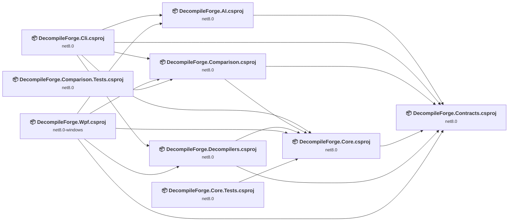
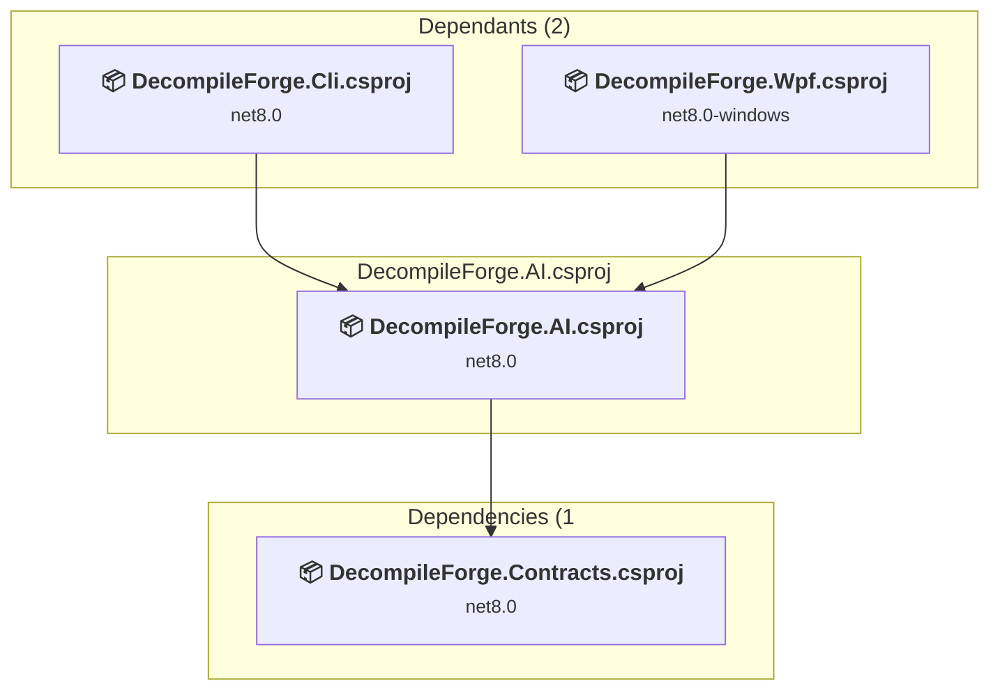
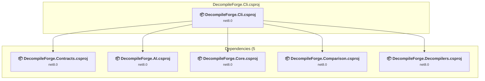
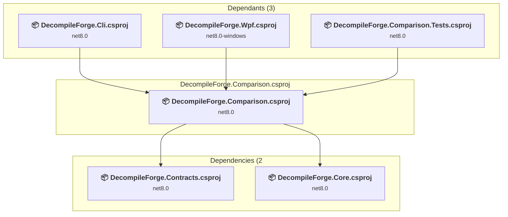
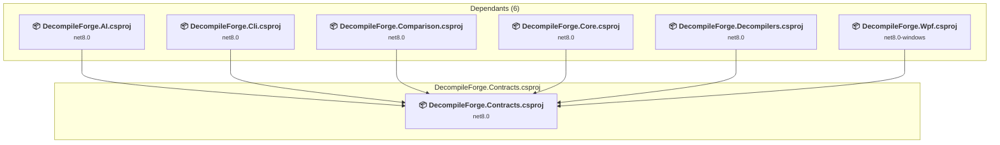
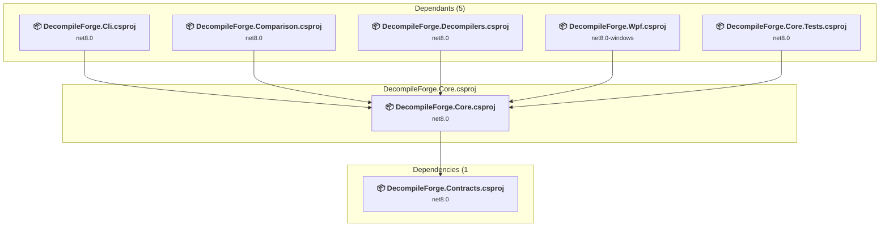
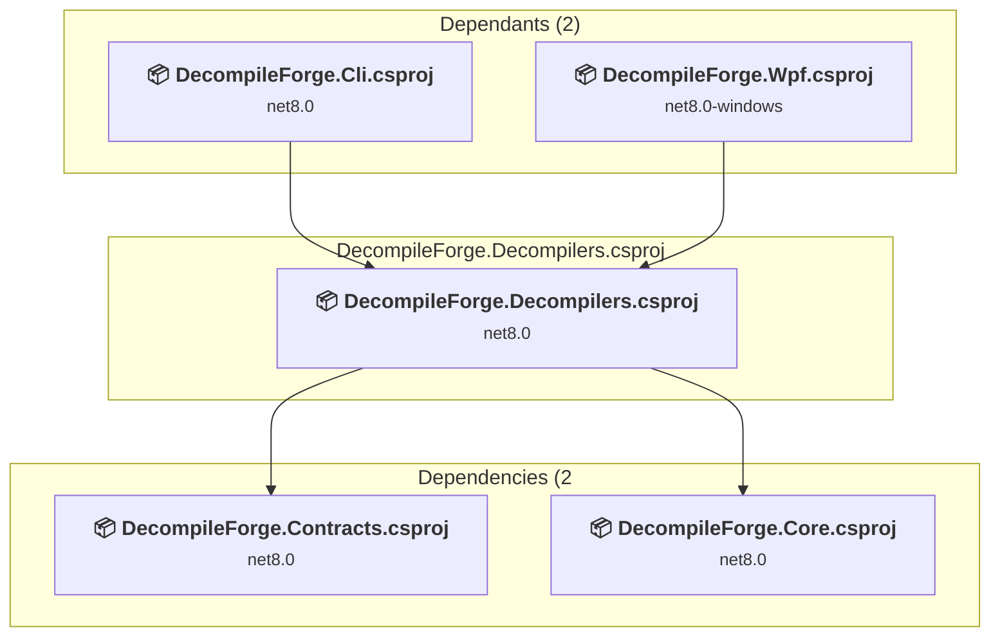
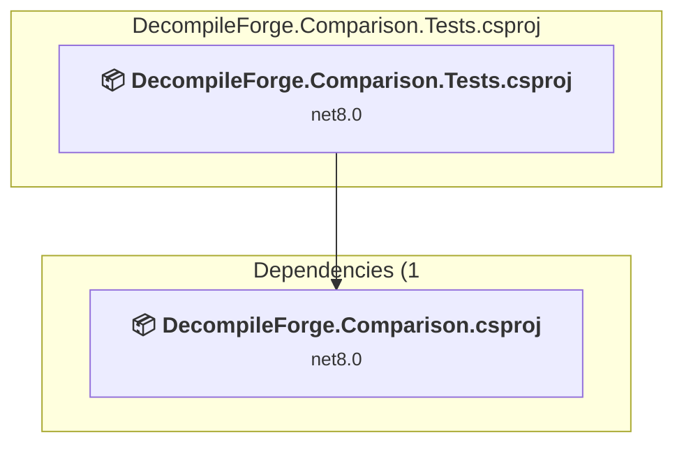
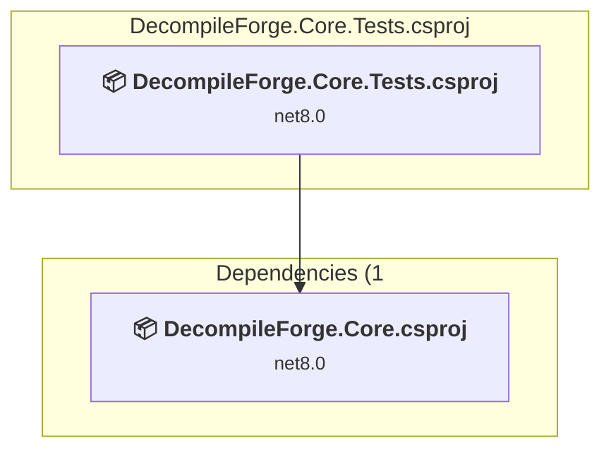

# Projects and dependencies analysis

This document provides a comprehensive overview of the projects and their dependencies in the context of upgrading to .NETCoreApp,Version=v10.0.

## Table of Contents

- [Executive Summary](#executive-Summary)
  - [Highlevel Metrics](#highlevel-metrics)
  - [Projects Compatibility](#projects-compatibility)
  - [Package Compatibility](#package-compatibility)
  - [API Compatibility](#api-compatibility)
  - [Binding Redirect Configuration](#binding-redirect-configuration)
- [Aggregate NuGet packages details](#aggregate-nuget-packages-details)
- [Top API Migration Challenges](#top-api-migration-challenges)
  - [Technologies and Features](#technologies-and-features)
  - [Most Frequent API Issues](#most-frequent-api-issues)
- [Projects Relationship Graph](#projects-relationship-graph)
- [Project Details](#project-details)

  - [src\DecompileForge.AI\DecompileForge.AI.csproj](#srcdecompileforgeaidecompileforgeaicsproj)
  - [src\DecompileForge.Cli\DecompileForge.Cli.csproj](#srcdecompileforgeclidecompileforgeclicsproj)
  - [src\DecompileForge.Comparison\DecompileForge.Comparison.csproj](#srcdecompileforgecomparisondecompileforgecomparisoncsproj)
  - [src\DecompileForge.Contracts\DecompileForge.Contracts.csproj](#srcdecompileforgecontractsdecompileforgecontractscsproj)
  - [src\DecompileForge.Core\DecompileForge.Core.csproj](#srcdecompileforgecoredecompileforgecorecsproj)
  - [src\DecompileForge.Decompilers\DecompileForge.Decompilers.csproj](#srcdecompileforgedecompilersdecompileforgedecompilerscsproj)
  - [src\DecompileForge.Wpf\DecompileForge.Wpf.csproj](#srcdecompileforgewpfdecompileforgewpfcsproj)
  - [tests\DecompileForge.Comparison.Tests\DecompileForge.Comparison.Tests.csproj](#testsdecompileforgecomparisontestsdecompileforgecomparisontestscsproj)
  - [tests\DecompileForge.Core.Tests\DecompileForge.Core.Tests.csproj](#testsdecompileforgecoretestsdecompileforgecoretestscsproj)

## Executive Summary

### Highlevel Metrics

| Metric | Count | Status |
| :--- | :---: | :--- |
| Total Projects | 9 | All require upgrade |
| Total NuGet Packages | 117 | 1 need upgrade |
| Total Code Files | 21 |  |
| Total Code Files with Incidents | 14 |  |
| Total Lines of Code | 746 |  |
| Total Number of Issues | 35 |  |
| Estimated LOC to modify | 24+ | at least 3.2% of codebase |

### Projects Compatibility

| Project | Target Framework | Difficulty | Package Issues | API Issues | Binding Issues | Est. LOC Impact | Description |
| :--- | :---: | :---: | :---: | :---: | :---: | :---: | :--- |
| [src\DecompileForge.AI\DecompileForge.AI.csproj](#srcdecompileforgeaidecompileforgeaicsproj) | net8.0 | 🟢 Low | 0 | 6 | 0 | 6+ | ClassLibrary, Sdk Style = True |
| [src\DecompileForge.Cli\DecompileForge.Cli.csproj](#srcdecompileforgeclidecompileforgeclicsproj) | net8.0 | 🟢 Low | 0 | 0 | 0 |  | DotNetCoreApp, Sdk Style = True |
| [src\DecompileForge.Comparison\DecompileForge.Comparison.csproj](#srcdecompileforgecomparisondecompileforgecomparisoncsproj) | net8.0 | 🟢 Low | 0 | 0 | 0 |  | ClassLibrary, Sdk Style = True |
| [src\DecompileForge.Contracts\DecompileForge.Contracts.csproj](#srcdecompileforgecontractsdecompileforgecontractscsproj) | net8.0 | 🟢 Low | 0 | 0 | 0 |  | ClassLibrary, Sdk Style = True |
| [src\DecompileForge.Core\DecompileForge.Core.csproj](#srcdecompileforgecoredecompileforgecorecsproj) | net8.0 | 🟢 Low | 0 | 0 | 0 |  | ClassLibrary, Sdk Style = True |
| [src\DecompileForge.Decompilers\DecompileForge.Decompilers.csproj](#srcdecompileforgedecompilersdecompileforgedecompilerscsproj) | net8.0 | 🟢 Low | 0 | 0 | 0 |  | ClassLibrary, Sdk Style = True |
| [src\DecompileForge.Wpf\DecompileForge.Wpf.csproj](#srcdecompileforgewpfdecompileforgewpfcsproj) | net8.0-windows | 🟢 Low | 0 | 18 | 0 | 18+ | Wpf, Sdk Style = True |
| [tests\DecompileForge.Comparison.Tests\DecompileForge.Comparison.Tests.csproj](#testsdecompileforgecomparisontestsdecompileforgecomparisontestscsproj) | net8.0 | 🟢 Low | 1 | 0 | 0 |  | DotNetCoreApp, Sdk Style = True |
| [tests\DecompileForge.Core.Tests\DecompileForge.Core.Tests.csproj](#testsdecompileforgecoretestsdecompileforgecoretestscsproj) | net8.0 | 🟢 Low | 1 | 0 | 0 |  | DotNetCoreApp, Sdk Style = True |

### Package Compatibility

| Status | Count | Percentage |
| :--- | :---: | :---: |
| ✅ Compatible | 116 | 99.1% |
| ⚠️ Incompatible | 1 | 0.9% |
| 🔄 Upgrade Recommended | 0 | 0.0% |
| ***Total NuGet Packages*** | ***117*** | ***100%*** |

### API Compatibility

| Category | Count | Impact |
| :--- | :---: | :--- |
| 🔴 Binary Incompatible | 16 | High - Require code changes |
| 🟡 Source Incompatible | 2 | Medium - Needs re-compilation and potential conflicting API error fixing |
| 🔵 Behavioral change | 6 | Low - Behavioral changes that may require testing at runtime |
| ✅ Compatible | 2042 |  |
| ***Total APIs Analyzed*** | ***2066*** |  |

## Aggregate NuGet packages details

| Package | Current Version | Suggested Version | Projects | Description |
| :--- | :---: | :---: | :--- | :--- |
| Anthropic | 12.46.0 |  | [DecompileForge.AI.csproj](#srcdecompileforgeaidecompileforgeaicsproj) [DecompileForge.Cli.csproj](#srcdecompileforgeclidecompileforgeclicsproj) [DecompileForge.Wpf.csproj](#srcdecompileforgewpfdecompileforgewpfcsproj) | ✅Compatible |
| AsmResolver | 6.0.1 |  | [DecompileForge.Cli.csproj](#srcdecompileforgeclidecompileforgeclicsproj) [DecompileForge.Decompilers.csproj](#srcdecompileforgedecompilersdecompileforgedecompilerscsproj) [DecompileForge.Wpf.csproj](#srcdecompileforgewpfdecompileforgewpfcsproj) | ✅Compatible |
| AsmResolver.DotNet | 6.0.1 |  | [DecompileForge.Cli.csproj](#srcdecompileforgeclidecompileforgeclicsproj) [DecompileForge.Decompilers.csproj](#srcdecompileforgedecompilersdecompileforgedecompilerscsproj) [DecompileForge.Wpf.csproj](#srcdecompileforgewpfdecompileforgewpfcsproj) | ✅Compatible |
| AsmResolver.PE | 6.0.1 |  | [DecompileForge.Cli.csproj](#srcdecompileforgeclidecompileforgeclicsproj) [DecompileForge.Decompilers.csproj](#srcdecompileforgedecompilersdecompileforgedecompilerscsproj) [DecompileForge.Wpf.csproj](#srcdecompileforgewpfdecompileforgewpfcsproj) | ✅Compatible |
| AsmResolver.PE.File | 6.0.1 |  | [DecompileForge.Cli.csproj](#srcdecompileforgeclidecompileforgeclicsproj) [DecompileForge.Decompilers.csproj](#srcdecompileforgedecompilersdecompileforgedecompilerscsproj) [DecompileForge.Wpf.csproj](#srcdecompileforgewpfdecompileforgewpfcsproj) | ✅Compatible |
| Azure.AI.OpenAI | 2.1.0 |  | [DecompileForge.AI.csproj](#srcdecompileforgeaidecompileforgeaicsproj) [DecompileForge.Cli.csproj](#srcdecompileforgeclidecompileforgeclicsproj) [DecompileForge.Wpf.csproj](#srcdecompileforgewpfdecompileforgewpfcsproj) | ✅Compatible |
| Azure.Core | 1.44.1 |  | [DecompileForge.AI.csproj](#srcdecompileforgeaidecompileforgeaicsproj) [DecompileForge.Cli.csproj](#srcdecompileforgeclidecompileforgeclicsproj) [DecompileForge.Wpf.csproj](#srcdecompileforgewpfdecompileforgewpfcsproj) | ✅Compatible |
| Castle.Core | 5.1.1 |  | [DecompileForge.Comparison.Tests.csproj](#testsdecompileforgecomparisontestsdecompileforgecomparisontestscsproj) | ✅Compatible |
| CommunityToolkit.Mvvm | 8.4.2 |  | [DecompileForge.Wpf.csproj](#srcdecompileforgewpfdecompileforgewpfcsproj) | ✅Compatible |
| coverlet.collector | 6.0.4 |  | [DecompileForge.Comparison.Tests.csproj](#testsdecompileforgecomparisontestsdecompileforgecomparisontestscsproj) [DecompileForge.Core.Tests.csproj](#testsdecompileforgecoretestsdecompileforgecoretestscsproj) | ✅Compatible |
| DiffPlex | 1.9.0 |  | [DecompileForge.Cli.csproj](#srcdecompileforgeclidecompileforgeclicsproj) [DecompileForge.Comparison.csproj](#srcdecompileforgecomparisondecompileforgecomparisoncsproj) [DecompileForge.Comparison.Tests.csproj](#testsdecompileforgecomparisontestsdecompileforgecomparisontestscsproj) [DecompileForge.Wpf.csproj](#srcdecompileforgewpfdecompileforgewpfcsproj) | ✅Compatible |
| FluentAssertions | 8.4.0 |  | [DecompileForge.Comparison.Tests.csproj](#testsdecompileforgecomparisontestsdecompileforgecomparisontestscsproj) [DecompileForge.Core.Tests.csproj](#testsdecompileforgecoretestsdecompileforgecoretestscsproj) | ✅Compatible |
| ICSharpCode.Decompiler | 11.0.0.9375 |  | [DecompileForge.Cli.csproj](#srcdecompileforgeclidecompileforgeclicsproj) [DecompileForge.Decompilers.csproj](#srcdecompileforgedecompilersdecompileforgedecompilerscsproj) [DecompileForge.Wpf.csproj](#srcdecompileforgewpfdecompileforgewpfcsproj) | ✅Compatible |
| IsExternalInit | 1.0.3 |  | [DecompileForge.Cli.csproj](#srcdecompileforgeclidecompileforgeclicsproj) [DecompileForge.Decompilers.csproj](#srcdecompileforgedecompilersdecompileforgedecompilerscsproj) [DecompileForge.Wpf.csproj](#srcdecompileforgewpfdecompileforgewpfcsproj) | ✅Compatible |
| Microsoft.Bcl.AsyncInterfaces | 6.0.0 |  | [DecompileForge.AI.csproj](#srcdecompileforgeaidecompileforgeaicsproj) [DecompileForge.Cli.csproj](#srcdecompileforgeclidecompileforgeclicsproj) [DecompileForge.Wpf.csproj](#srcdecompileforgewpfdecompileforgewpfcsproj) | ✅Compatible |
| Microsoft.CodeAnalysis.Analyzers | 5.9.0-1.26328.17 |  | [DecompileForge.Cli.csproj](#srcdecompileforgeclidecompileforgeclicsproj) [DecompileForge.Comparison.csproj](#srcdecompileforgecomparisondecompileforgecomparisoncsproj) [DecompileForge.Comparison.Tests.csproj](#testsdecompileforgecomparisontestsdecompileforgecomparisontestscsproj) [DecompileForge.Wpf.csproj](#srcdecompileforgewpfdecompileforgewpfcsproj) | ✅Compatible |
| Microsoft.CodeAnalysis.Common | 5.9.0 |  | [DecompileForge.Cli.csproj](#srcdecompileforgeclidecompileforgeclicsproj) [DecompileForge.Comparison.csproj](#srcdecompileforgecomparisondecompileforgecomparisoncsproj) [DecompileForge.Comparison.Tests.csproj](#testsdecompileforgecomparisontestsdecompileforgecomparisontestscsproj) [DecompileForge.Wpf.csproj](#srcdecompileforgewpfdecompileforgewpfcsproj) | ✅Compatible |
| Microsoft.CodeAnalysis.CSharp | 5.9.0 |  | [DecompileForge.Cli.csproj](#srcdecompileforgeclidecompileforgeclicsproj) [DecompileForge.Comparison.csproj](#srcdecompileforgecomparisondecompileforgecomparisoncsproj) [DecompileForge.Comparison.Tests.csproj](#testsdecompileforgecomparisontestsdecompileforgecomparisontestscsproj) [DecompileForge.Wpf.csproj](#srcdecompileforgewpfdecompileforgewpfcsproj) | ✅Compatible |
| Microsoft.CodeCoverage | 17.14.1 |  | [DecompileForge.Comparison.Tests.csproj](#testsdecompileforgecomparisontestsdecompileforgecomparisontestscsproj) [DecompileForge.Core.Tests.csproj](#testsdecompileforgecoretestsdecompileforgecoretestscsproj) | ✅Compatible |
| Microsoft.Extensions.AI | 10.10.0 |  | [DecompileForge.AI.csproj](#srcdecompileforgeaidecompileforgeaicsproj) [DecompileForge.Cli.csproj](#srcdecompileforgeclidecompileforgeclicsproj) [DecompileForge.Wpf.csproj](#srcdecompileforgewpfdecompileforgewpfcsproj) | ✅Compatible |
| Microsoft.Extensions.AI.Abstractions | 10.10.0 |  | [DecompileForge.AI.csproj](#srcdecompileforgeaidecompileforgeaicsproj) [DecompileForge.Cli.csproj](#srcdecompileforgeclidecompileforgeclicsproj) [DecompileForge.Wpf.csproj](#srcdecompileforgewpfdecompileforgewpfcsproj) | ✅Compatible |
| Microsoft.Extensions.AI.OpenAI | 10.10.0 |  | [DecompileForge.AI.csproj](#srcdecompileforgeaidecompileforgeaicsproj) [DecompileForge.Cli.csproj](#srcdecompileforgeclidecompileforgeclicsproj) [DecompileForge.Wpf.csproj](#srcdecompileforgewpfdecompileforgewpfcsproj) | ✅Compatible |
| Microsoft.Extensions.AmbientMetadata.Application | 10.10.0 |  | [DecompileForge.AI.csproj](#srcdecompileforgeaidecompileforgeaicsproj) [DecompileForge.Cli.csproj](#srcdecompileforgeclidecompileforgeclicsproj) [DecompileForge.Wpf.csproj](#srcdecompileforgewpfdecompileforgewpfcsproj) | ✅Compatible |
| Microsoft.Extensions.Caching.Abstractions | 10.0.12 |  | [DecompileForge.AI.csproj](#srcdecompileforgeaidecompileforgeaicsproj) [DecompileForge.Cli.csproj](#srcdecompileforgeclidecompileforgeclicsproj) [DecompileForge.Wpf.csproj](#srcdecompileforgewpfdecompileforgewpfcsproj) | ✅Compatible |
| Microsoft.Extensions.Compliance.Abstractions | 10.10.0 |  | [DecompileForge.AI.csproj](#srcdecompileforgeaidecompileforgeaicsproj) [DecompileForge.Cli.csproj](#srcdecompileforgeclidecompileforgeclicsproj) [DecompileForge.Wpf.csproj](#srcdecompileforgewpfdecompileforgewpfcsproj) | ✅Compatible |
| Microsoft.Extensions.Configuration | 10.0.12 |  | [DecompileForge.Wpf.csproj](#srcdecompileforgewpfdecompileforgewpfcsproj) | ✅Compatible |
| Microsoft.Extensions.Configuration | 8.0.0 |  | [DecompileForge.AI.csproj](#srcdecompileforgeaidecompileforgeaicsproj) [DecompileForge.Cli.csproj](#srcdecompileforgeclidecompileforgeclicsproj) | ✅Compatible |
| Microsoft.Extensions.Configuration.Abstractions | 10.0.12 |  | [DecompileForge.Wpf.csproj](#srcdecompileforgewpfdecompileforgewpfcsproj) | ✅Compatible |
| Microsoft.Extensions.Configuration.Abstractions | 10.0.3 |  | [DecompileForge.AI.csproj](#srcdecompileforgeaidecompileforgeaicsproj) [DecompileForge.Cli.csproj](#srcdecompileforgeclidecompileforgeclicsproj) | ✅Compatible |
| Microsoft.Extensions.Configuration.Binder | 10.0.12 |  | [DecompileForge.Wpf.csproj](#srcdecompileforgewpfdecompileforgewpfcsproj) | ✅Compatible |
| Microsoft.Extensions.Configuration.Binder | 8.0.2 |  | [DecompileForge.AI.csproj](#srcdecompileforgeaidecompileforgeaicsproj) [DecompileForge.Cli.csproj](#srcdecompileforgeclidecompileforgeclicsproj) | ✅Compatible |
| Microsoft.Extensions.Configuration.CommandLine | 10.0.12 |  | [DecompileForge.Wpf.csproj](#srcdecompileforgewpfdecompileforgewpfcsproj) | ✅Compatible |
| Microsoft.Extensions.Configuration.EnvironmentVariables | 10.0.12 |  | [DecompileForge.Wpf.csproj](#srcdecompileforgewpfdecompileforgewpfcsproj) | ✅Compatible |
| Microsoft.Extensions.Configuration.FileExtensions | 10.0.12 |  | [DecompileForge.Wpf.csproj](#srcdecompileforgewpfdecompileforgewpfcsproj) | ✅Compatible |
| Microsoft.Extensions.Configuration.Json | 10.0.12 |  | [DecompileForge.Wpf.csproj](#srcdecompileforgewpfdecompileforgewpfcsproj) | ✅Compatible |
| Microsoft.Extensions.Configuration.UserSecrets | 10.0.12 |  | [DecompileForge.Wpf.csproj](#srcdecompileforgewpfdecompileforgewpfcsproj) | ✅Compatible |
| Microsoft.Extensions.DependencyInjection | 10.0.12 |  | [DecompileForge.Wpf.csproj](#srcdecompileforgewpfdecompileforgewpfcsproj) | ✅Compatible |
| Microsoft.Extensions.DependencyInjection | 8.0.1 |  | [DecompileForge.AI.csproj](#srcdecompileforgeaidecompileforgeaicsproj) [DecompileForge.Cli.csproj](#srcdecompileforgeclidecompileforgeclicsproj) | ✅Compatible |
| Microsoft.Extensions.DependencyInjection.Abstractions | 10.0.12 |  | [DecompileForge.AI.csproj](#srcdecompileforgeaidecompileforgeaicsproj) [DecompileForge.Cli.csproj](#srcdecompileforgeclidecompileforgeclicsproj) [DecompileForge.Comparison.csproj](#srcdecompileforgecomparisondecompileforgecomparisoncsproj) [DecompileForge.Comparison.Tests.csproj](#testsdecompileforgecomparisontestsdecompileforgecomparisontestscsproj) [DecompileForge.Wpf.csproj](#srcdecompileforgewpfdecompileforgewpfcsproj) | ✅Compatible |
| Microsoft.Extensions.DependencyInjection.AutoActivation | 10.10.0 |  | [DecompileForge.AI.csproj](#srcdecompileforgeaidecompileforgeaicsproj) [DecompileForge.Cli.csproj](#srcdecompileforgeclidecompileforgeclicsproj) [DecompileForge.Wpf.csproj](#srcdecompileforgewpfdecompileforgewpfcsproj) | ✅Compatible |
| Microsoft.Extensions.Diagnostics | 10.0.12 |  | [DecompileForge.Wpf.csproj](#srcdecompileforgewpfdecompileforgewpfcsproj) | ✅Compatible |
| Microsoft.Extensions.Diagnostics | 8.0.1 |  | [DecompileForge.AI.csproj](#srcdecompileforgeaidecompileforgeaicsproj) [DecompileForge.Cli.csproj](#srcdecompileforgeclidecompileforgeclicsproj) | ✅Compatible |
| Microsoft.Extensions.Diagnostics.Abstractions | 10.0.12 |  | [DecompileForge.Wpf.csproj](#srcdecompileforgewpfdecompileforgewpfcsproj) | ✅Compatible |
| Microsoft.Extensions.Diagnostics.Abstractions | 10.0.3 |  | [DecompileForge.AI.csproj](#srcdecompileforgeaidecompileforgeaicsproj) [DecompileForge.Cli.csproj](#srcdecompileforgeclidecompileforgeclicsproj) | ✅Compatible |
| Microsoft.Extensions.Diagnostics.ExceptionSummarization | 10.10.0 |  | [DecompileForge.AI.csproj](#srcdecompileforgeaidecompileforgeaicsproj) [DecompileForge.Cli.csproj](#srcdecompileforgeclidecompileforgeclicsproj) [DecompileForge.Wpf.csproj](#srcdecompileforgewpfdecompileforgewpfcsproj) | ✅Compatible |
| Microsoft.Extensions.FileProviders.Abstractions | 10.0.12 |  | [DecompileForge.Wpf.csproj](#srcdecompileforgewpfdecompileforgewpfcsproj) | ✅Compatible |
| Microsoft.Extensions.FileProviders.Abstractions | 10.0.3 |  | [DecompileForge.AI.csproj](#srcdecompileforgeaidecompileforgeaicsproj) [DecompileForge.Cli.csproj](#srcdecompileforgeclidecompileforgeclicsproj) | ✅Compatible |
| Microsoft.Extensions.FileProviders.Physical | 10.0.12 |  | [DecompileForge.Wpf.csproj](#srcdecompileforgewpfdecompileforgewpfcsproj) | ✅Compatible |
| Microsoft.Extensions.FileSystemGlobbing | 10.0.12 |  | [DecompileForge.Wpf.csproj](#srcdecompileforgewpfdecompileforgewpfcsproj) | ✅Compatible |
| Microsoft.Extensions.Hosting | 10.0.12 |  | [DecompileForge.Wpf.csproj](#srcdecompileforgewpfdecompileforgewpfcsproj) | ✅Compatible |
| Microsoft.Extensions.Hosting.Abstractions | 10.0.12 |  | [DecompileForge.Wpf.csproj](#srcdecompileforgewpfdecompileforgewpfcsproj) | ✅Compatible |
| Microsoft.Extensions.Hosting.Abstractions | 10.0.3 |  | [DecompileForge.AI.csproj](#srcdecompileforgeaidecompileforgeaicsproj) [DecompileForge.Cli.csproj](#srcdecompileforgeclidecompileforgeclicsproj) | ✅Compatible |
| Microsoft.Extensions.Http | 8.0.1 |  | [DecompileForge.AI.csproj](#srcdecompileforgeaidecompileforgeaicsproj) [DecompileForge.Cli.csproj](#srcdecompileforgeclidecompileforgeclicsproj) [DecompileForge.Wpf.csproj](#srcdecompileforgewpfdecompileforgewpfcsproj) | ✅Compatible |
| Microsoft.Extensions.Http.Diagnostics | 10.10.0 |  | [DecompileForge.AI.csproj](#srcdecompileforgeaidecompileforgeaicsproj) [DecompileForge.Cli.csproj](#srcdecompileforgeclidecompileforgeclicsproj) [DecompileForge.Wpf.csproj](#srcdecompileforgewpfdecompileforgewpfcsproj) | ✅Compatible |
| Microsoft.Extensions.Http.Resilience | 10.10.0 |  | [DecompileForge.AI.csproj](#srcdecompileforgeaidecompileforgeaicsproj) [DecompileForge.Cli.csproj](#srcdecompileforgeclidecompileforgeclicsproj) [DecompileForge.Wpf.csproj](#srcdecompileforgewpfdecompileforgewpfcsproj) | ✅Compatible |
| Microsoft.Extensions.Logging | 10.0.12 |  | [DecompileForge.Wpf.csproj](#srcdecompileforgewpfdecompileforgewpfcsproj) | ✅Compatible |
| Microsoft.Extensions.Logging | 8.0.1 |  | [DecompileForge.AI.csproj](#srcdecompileforgeaidecompileforgeaicsproj) [DecompileForge.Cli.csproj](#srcdecompileforgeclidecompileforgeclicsproj) | ✅Compatible |
| Microsoft.Extensions.Logging.Abstractions | 10.0.12 |  | [DecompileForge.AI.csproj](#srcdecompileforgeaidecompileforgeaicsproj) [DecompileForge.Cli.csproj](#srcdecompileforgeclidecompileforgeclicsproj) [DecompileForge.Comparison.csproj](#srcdecompileforgecomparisondecompileforgecomparisoncsproj) [DecompileForge.Comparison.Tests.csproj](#testsdecompileforgecomparisontestsdecompileforgecomparisontestscsproj) [DecompileForge.Wpf.csproj](#srcdecompileforgewpfdecompileforgewpfcsproj) | ✅Compatible |
| Microsoft.Extensions.Logging.Configuration | 10.0.12 |  | [DecompileForge.Wpf.csproj](#srcdecompileforgewpfdecompileforgewpfcsproj) | ✅Compatible |
| Microsoft.Extensions.Logging.Configuration | 8.0.1 |  | [DecompileForge.AI.csproj](#srcdecompileforgeaidecompileforgeaicsproj) [DecompileForge.Cli.csproj](#srcdecompileforgeclidecompileforgeclicsproj) | ✅Compatible |
| Microsoft.Extensions.Logging.Console | 10.0.12 |  | [DecompileForge.Wpf.csproj](#srcdecompileforgewpfdecompileforgewpfcsproj) | ✅Compatible |
| Microsoft.Extensions.Logging.Debug | 10.0.12 |  | [DecompileForge.Wpf.csproj](#srcdecompileforgewpfdecompileforgewpfcsproj) | ✅Compatible |
| Microsoft.Extensions.Logging.EventLog | 10.0.12 |  | [DecompileForge.Wpf.csproj](#srcdecompileforgewpfdecompileforgewpfcsproj) | ✅Compatible |
| Microsoft.Extensions.Logging.EventSource | 10.0.12 |  | [DecompileForge.Wpf.csproj](#srcdecompileforgewpfdecompileforgewpfcsproj) | ✅Compatible |
| Microsoft.Extensions.ObjectPool | 8.0.31 |  | [DecompileForge.AI.csproj](#srcdecompileforgeaidecompileforgeaicsproj) [DecompileForge.Cli.csproj](#srcdecompileforgeclidecompileforgeclicsproj) [DecompileForge.Wpf.csproj](#srcdecompileforgewpfdecompileforgewpfcsproj) | ✅Compatible |
| Microsoft.Extensions.Options | 10.0.12 |  | [DecompileForge.Wpf.csproj](#srcdecompileforgewpfdecompileforgewpfcsproj) | ✅Compatible |
| Microsoft.Extensions.Options | 10.0.3 |  | [DecompileForge.AI.csproj](#srcdecompileforgeaidecompileforgeaicsproj) [DecompileForge.Cli.csproj](#srcdecompileforgeclidecompileforgeclicsproj) | ✅Compatible |
| Microsoft.Extensions.Options.ConfigurationExtensions | 10.0.12 |  | [DecompileForge.Wpf.csproj](#srcdecompileforgewpfdecompileforgewpfcsproj) | ✅Compatible |
| Microsoft.Extensions.Options.ConfigurationExtensions | 8.0.0 |  | [DecompileForge.AI.csproj](#srcdecompileforgeaidecompileforgeaicsproj) [DecompileForge.Cli.csproj](#srcdecompileforgeclidecompileforgeclicsproj) | ✅Compatible |
| Microsoft.Extensions.Primitives | 10.0.12 |  | [DecompileForge.AI.csproj](#srcdecompileforgeaidecompileforgeaicsproj) [DecompileForge.Cli.csproj](#srcdecompileforgeclidecompileforgeclicsproj) [DecompileForge.Wpf.csproj](#srcdecompileforgewpfdecompileforgewpfcsproj) | ✅Compatible |
| Microsoft.Extensions.Resilience | 10.10.0 |  | [DecompileForge.AI.csproj](#srcdecompileforgeaidecompileforgeaicsproj) [DecompileForge.Cli.csproj](#srcdecompileforgeclidecompileforgeclicsproj) [DecompileForge.Wpf.csproj](#srcdecompileforgewpfdecompileforgewpfcsproj) | ✅Compatible |
| Microsoft.Extensions.Telemetry | 10.10.0 |  | [DecompileForge.AI.csproj](#srcdecompileforgeaidecompileforgeaicsproj) [DecompileForge.Cli.csproj](#srcdecompileforgeclidecompileforgeclicsproj) [DecompileForge.Wpf.csproj](#srcdecompileforgewpfdecompileforgewpfcsproj) | ✅Compatible |
| Microsoft.Extensions.Telemetry.Abstractions | 10.10.0 |  | [DecompileForge.AI.csproj](#srcdecompileforgeaidecompileforgeaicsproj) [DecompileForge.Cli.csproj](#srcdecompileforgeclidecompileforgeclicsproj) [DecompileForge.Wpf.csproj](#srcdecompileforgewpfdecompileforgewpfcsproj) | ✅Compatible |
| Microsoft.NET.Test.Sdk | 17.14.1 |  | [DecompileForge.Comparison.Tests.csproj](#testsdecompileforgecomparisontestsdecompileforgecomparisontestscsproj) [DecompileForge.Core.Tests.csproj](#testsdecompileforgecoretestsdecompileforgecoretestscsproj) | ✅Compatible |
| Microsoft.TestPlatform.ObjectModel | 17.14.1 |  | [DecompileForge.Comparison.Tests.csproj](#testsdecompileforgecomparisontestsdecompileforgecomparisontestscsproj) [DecompileForge.Core.Tests.csproj](#testsdecompileforgecoretestsdecompileforgecoretestscsproj) | ✅Compatible |
| Microsoft.TestPlatform.TestHost | 17.14.1 |  | [DecompileForge.Comparison.Tests.csproj](#testsdecompileforgecomparisontestsdecompileforgecomparisontestscsproj) [DecompileForge.Core.Tests.csproj](#testsdecompileforgecoretestsdecompileforgecoretestscsproj) | ✅Compatible |
| Moq | 4.20.72 |  | [DecompileForge.Comparison.Tests.csproj](#testsdecompileforgecomparisontestsdecompileforgecomparisontestscsproj) | ✅Compatible |
| Newtonsoft.Json | 13.0.3 |  | [DecompileForge.Comparison.Tests.csproj](#testsdecompileforgecomparisontestsdecompileforgecomparisontestscsproj) [DecompileForge.Core.Tests.csproj](#testsdecompileforgecoretestsdecompileforgecoretestscsproj) | ✅Compatible |
| OllamaSharp | 5.4.30 |  | [DecompileForge.AI.csproj](#srcdecompileforgeaidecompileforgeaicsproj) [DecompileForge.Cli.csproj](#srcdecompileforgeclidecompileforgeclicsproj) [DecompileForge.Wpf.csproj](#srcdecompileforgewpfdecompileforgewpfcsproj) | ✅Compatible |
| OpenAI | 2.13.0 |  | [DecompileForge.AI.csproj](#srcdecompileforgeaidecompileforgeaicsproj) [DecompileForge.Cli.csproj](#srcdecompileforgeclidecompileforgeclicsproj) [DecompileForge.Wpf.csproj](#srcdecompileforgewpfdecompileforgewpfcsproj) | ✅Compatible |
| Polly.Core | 8.4.2 |  | [DecompileForge.AI.csproj](#srcdecompileforgeaidecompileforgeaicsproj) [DecompileForge.Cli.csproj](#srcdecompileforgeclidecompileforgeclicsproj) [DecompileForge.Wpf.csproj](#srcdecompileforgewpfdecompileforgewpfcsproj) | ✅Compatible |
| Polly.Extensions | 8.4.2 |  | [DecompileForge.AI.csproj](#srcdecompileforgeaidecompileforgeaicsproj) [DecompileForge.Cli.csproj](#srcdecompileforgeclidecompileforgeclicsproj) [DecompileForge.Wpf.csproj](#srcdecompileforgewpfdecompileforgewpfcsproj) | ✅Compatible |
| Polly.RateLimiting | 8.4.2 |  | [DecompileForge.AI.csproj](#srcdecompileforgeaidecompileforgeaicsproj) [DecompileForge.Cli.csproj](#srcdecompileforgeclidecompileforgeclicsproj) [DecompileForge.Wpf.csproj](#srcdecompileforgewpfdecompileforgewpfcsproj) | ✅Compatible |
| System.Buffers | 4.6.1 |  | [DecompileForge.Cli.csproj](#srcdecompileforgeclidecompileforgeclicsproj) [DecompileForge.Comparison.csproj](#srcdecompileforgecomparisondecompileforgecomparisoncsproj) [DecompileForge.Comparison.Tests.csproj](#testsdecompileforgecomparisontestsdecompileforgecomparisontestscsproj) [DecompileForge.Wpf.csproj](#srcdecompileforgewpfdecompileforgewpfcsproj) | ✅Compatible |
| System.ClientModel | 1.14.0 |  | [DecompileForge.AI.csproj](#srcdecompileforgeaidecompileforgeaicsproj) [DecompileForge.Cli.csproj](#srcdecompileforgeclidecompileforgeclicsproj) [DecompileForge.Wpf.csproj](#srcdecompileforgewpfdecompileforgewpfcsproj) | ✅Compatible |
| System.Collections.Immutable | 10.0.1 |  | [DecompileForge.Cli.csproj](#srcdecompileforgeclidecompileforgeclicsproj) [DecompileForge.Comparison.csproj](#srcdecompileforgecomparisondecompileforgecomparisoncsproj) [DecompileForge.Comparison.Tests.csproj](#testsdecompileforgecomparisontestsdecompileforgecomparisontestscsproj) [DecompileForge.Wpf.csproj](#srcdecompileforgewpfdecompileforgewpfcsproj) | ✅Compatible |
| System.Collections.Immutable | 8.0.0 |  | [DecompileForge.Core.Tests.csproj](#testsdecompileforgecoretestsdecompileforgecoretestscsproj) | ✅Compatible |
| System.Collections.Immutable | 9.0.0 |  | [DecompileForge.Decompilers.csproj](#srcdecompileforgedecompilersdecompileforgedecompilerscsproj) | ✅Compatible |
| System.Diagnostics.DiagnosticSource | 10.0.12 |  | [DecompileForge.AI.csproj](#srcdecompileforgeaidecompileforgeaicsproj) [DecompileForge.Cli.csproj](#srcdecompileforgeclidecompileforgeclicsproj) [DecompileForge.Comparison.csproj](#srcdecompileforgecomparisondecompileforgecomparisoncsproj) [DecompileForge.Comparison.Tests.csproj](#testsdecompileforgecomparisontestsdecompileforgecomparisontestscsproj) [DecompileForge.Wpf.csproj](#srcdecompileforgewpfdecompileforgewpfcsproj) | ✅Compatible |
| System.Diagnostics.EventLog | 10.0.12 |  | [DecompileForge.Wpf.csproj](#srcdecompileforgewpfdecompileforgewpfcsproj) | ✅Compatible |
| System.Diagnostics.EventLog | 6.0.0 |  | [DecompileForge.Comparison.Tests.csproj](#testsdecompileforgecomparisontestsdecompileforgecomparisontestscsproj) | ✅Compatible |
| System.IO.Pipelines | 10.0.12 |  | [DecompileForge.AI.csproj](#srcdecompileforgeaidecompileforgeaicsproj) [DecompileForge.Cli.csproj](#srcdecompileforgeclidecompileforgeclicsproj) [DecompileForge.Wpf.csproj](#srcdecompileforgewpfdecompileforgewpfcsproj) | ✅Compatible |
| System.Memory | 4.6.3 |  | [DecompileForge.Cli.csproj](#srcdecompileforgeclidecompileforgeclicsproj) [DecompileForge.Comparison.csproj](#srcdecompileforgecomparisondecompileforgecomparisoncsproj) [DecompileForge.Comparison.Tests.csproj](#testsdecompileforgecomparisontestsdecompileforgecomparisontestscsproj) [DecompileForge.Wpf.csproj](#srcdecompileforgewpfdecompileforgewpfcsproj) | ✅Compatible |
| System.Memory.Data | 10.0.3 |  | [DecompileForge.AI.csproj](#srcdecompileforgeaidecompileforgeaicsproj) [DecompileForge.Cli.csproj](#srcdecompileforgeclidecompileforgeclicsproj) [DecompileForge.Wpf.csproj](#srcdecompileforgewpfdecompileforgewpfcsproj) | ✅Compatible |
| System.Net.ServerSentEvents | 10.0.2 |  | [DecompileForge.AI.csproj](#srcdecompileforgeaidecompileforgeaicsproj) [DecompileForge.Cli.csproj](#srcdecompileforgeclidecompileforgeclicsproj) [DecompileForge.Wpf.csproj](#srcdecompileforgewpfdecompileforgewpfcsproj) | ✅Compatible |
| System.Numerics.Tensors | 10.0.12 |  | [DecompileForge.AI.csproj](#srcdecompileforgeaidecompileforgeaicsproj) [DecompileForge.Cli.csproj](#srcdecompileforgeclidecompileforgeclicsproj) [DecompileForge.Wpf.csproj](#srcdecompileforgewpfdecompileforgewpfcsproj) | ✅Compatible |
| System.Numerics.Vectors | 4.5.0 |  | [DecompileForge.AI.csproj](#srcdecompileforgeaidecompileforgeaicsproj) | ✅Compatible |
| System.Numerics.Vectors | 4.6.1 |  | [DecompileForge.Cli.csproj](#srcdecompileforgeclidecompileforgeclicsproj) [DecompileForge.Comparison.csproj](#srcdecompileforgecomparisondecompileforgecomparisoncsproj) [DecompileForge.Comparison.Tests.csproj](#testsdecompileforgecomparisontestsdecompileforgecomparisontestscsproj) [DecompileForge.Wpf.csproj](#srcdecompileforgewpfdecompileforgewpfcsproj) | ✅Compatible |
| System.Reflection.Metadata | 10.0.1 |  | [DecompileForge.Cli.csproj](#srcdecompileforgeclidecompileforgeclicsproj) [DecompileForge.Comparison.csproj](#srcdecompileforgecomparisondecompileforgecomparisoncsproj) [DecompileForge.Comparison.Tests.csproj](#testsdecompileforgecomparisontestsdecompileforgecomparisontestscsproj) [DecompileForge.Wpf.csproj](#srcdecompileforgewpfdecompileforgewpfcsproj) | ✅Compatible |
| System.Reflection.Metadata | 8.0.0 |  | [DecompileForge.Core.Tests.csproj](#testsdecompileforgecoretestsdecompileforgecoretestscsproj) | ✅Compatible |
| System.Reflection.Metadata | 9.0.0 |  | [DecompileForge.Decompilers.csproj](#srcdecompileforgedecompilersdecompileforgedecompilerscsproj) | ✅Compatible |
| System.Runtime.CompilerServices.Unsafe | 6.1.2 |  | [DecompileForge.Cli.csproj](#srcdecompileforgeclidecompileforgeclicsproj) [DecompileForge.Comparison.csproj](#srcdecompileforgecomparisondecompileforgecomparisoncsproj) [DecompileForge.Comparison.Tests.csproj](#testsdecompileforgecomparisontestsdecompileforgecomparisontestscsproj) [DecompileForge.Wpf.csproj](#srcdecompileforgewpfdecompileforgewpfcsproj) | ✅Compatible |
| System.Text.Encoding.CodePages | 8.0.0 |  | [DecompileForge.Cli.csproj](#srcdecompileforgeclidecompileforgeclicsproj) [DecompileForge.Comparison.csproj](#srcdecompileforgecomparisondecompileforgecomparisoncsproj) [DecompileForge.Comparison.Tests.csproj](#testsdecompileforgecomparisontestsdecompileforgecomparisontestscsproj) [DecompileForge.Wpf.csproj](#srcdecompileforgewpfdecompileforgewpfcsproj) | ✅Compatible |
| System.Text.Encodings.Web | 10.0.12 |  | [DecompileForge.AI.csproj](#srcdecompileforgeaidecompileforgeaicsproj) [DecompileForge.Cli.csproj](#srcdecompileforgeclidecompileforgeclicsproj) [DecompileForge.Wpf.csproj](#srcdecompileforgewpfdecompileforgewpfcsproj) | ✅Compatible |
| System.Text.Json | 10.0.12 |  | [DecompileForge.AI.csproj](#srcdecompileforgeaidecompileforgeaicsproj) [DecompileForge.Cli.csproj](#srcdecompileforgeclidecompileforgeclicsproj) [DecompileForge.Wpf.csproj](#srcdecompileforgewpfdecompileforgewpfcsproj) | ✅Compatible |
| System.Threading.Channels | 10.0.12 |  | [DecompileForge.AI.csproj](#srcdecompileforgeaidecompileforgeaicsproj) [DecompileForge.Cli.csproj](#srcdecompileforgeclidecompileforgeclicsproj) [DecompileForge.Wpf.csproj](#srcdecompileforgewpfdecompileforgewpfcsproj) | ✅Compatible |
| System.Threading.RateLimiting | 8.0.0 |  | [DecompileForge.AI.csproj](#srcdecompileforgeaidecompileforgeaicsproj) [DecompileForge.Cli.csproj](#srcdecompileforgeclidecompileforgeclicsproj) [DecompileForge.Wpf.csproj](#srcdecompileforgewpfdecompileforgewpfcsproj) | ✅Compatible |
| System.Threading.Tasks.Extensions | 4.5.4 |  | [DecompileForge.AI.csproj](#srcdecompileforgeaidecompileforgeaicsproj) | ✅Compatible |
| System.Threading.Tasks.Extensions | 4.6.3 |  | [DecompileForge.Cli.csproj](#srcdecompileforgeclidecompileforgeclicsproj) [DecompileForge.Comparison.csproj](#srcdecompileforgecomparisondecompileforgecomparisoncsproj) [DecompileForge.Comparison.Tests.csproj](#testsdecompileforgecomparisontestsdecompileforgecomparisontestscsproj) [DecompileForge.Wpf.csproj](#srcdecompileforgewpfdecompileforgewpfcsproj) | ✅Compatible |
| xunit | 2.9.3 |  | [DecompileForge.Comparison.Tests.csproj](#testsdecompileforgecomparisontestsdecompileforgecomparisontestscsproj) [DecompileForge.Core.Tests.csproj](#testsdecompileforgecoretestsdecompileforgecoretestscsproj) | ⚠️NuGet package is deprecated |
| xunit.abstractions | 2.0.3 |  | [DecompileForge.Comparison.Tests.csproj](#testsdecompileforgecomparisontestsdecompileforgecomparisontestscsproj) [DecompileForge.Core.Tests.csproj](#testsdecompileforgecoretestsdecompileforgecoretestscsproj) | ✅Compatible |
| xunit.analyzers | 1.18.0 |  | [DecompileForge.Comparison.Tests.csproj](#testsdecompileforgecomparisontestsdecompileforgecomparisontestscsproj) [DecompileForge.Core.Tests.csproj](#testsdecompileforgecoretestsdecompileforgecoretestscsproj) | ✅Compatible |
| xunit.assert | 2.9.3 |  | [DecompileForge.Comparison.Tests.csproj](#testsdecompileforgecomparisontestsdecompileforgecomparisontestscsproj) [DecompileForge.Core.Tests.csproj](#testsdecompileforgecoretestsdecompileforgecoretestscsproj) | ✅Compatible |
| xunit.core | 2.9.3 |  | [DecompileForge.Comparison.Tests.csproj](#testsdecompileforgecomparisontestsdecompileforgecomparisontestscsproj) [DecompileForge.Core.Tests.csproj](#testsdecompileforgecoretestsdecompileforgecoretestscsproj) | ✅Compatible |
| xunit.extensibility.core | 2.9.3 |  | [DecompileForge.Comparison.Tests.csproj](#testsdecompileforgecomparisontestsdecompileforgecomparisontestscsproj) [DecompileForge.Core.Tests.csproj](#testsdecompileforgecoretestsdecompileforgecoretestscsproj) | ✅Compatible |
| xunit.extensibility.execution | 2.9.3 |  | [DecompileForge.Comparison.Tests.csproj](#testsdecompileforgecomparisontestsdecompileforgecomparisontestscsproj) [DecompileForge.Core.Tests.csproj](#testsdecompileforgecoretestsdecompileforgecoretestscsproj) | ✅Compatible |
| xunit.runner.visualstudio | 3.1.1 |  | [DecompileForge.Comparison.Tests.csproj](#testsdecompileforgecomparisontestsdecompileforgecomparisontestscsproj) [DecompileForge.Core.Tests.csproj](#testsdecompileforgecoretestsdecompileforgecoretestscsproj) | ✅Compatible |

## Top API Migration Challenges

### Technologies and Features

| Technology | Issues | Percentage | Migration Path |
| :--- | :---: | :---: | :--- |
| WPF (Windows Presentation Foundation) | 1 | 4.2% | WPF APIs for building Windows desktop applications with XAML-based UI that are available in .NET on Windows. WPF provides rich desktop UI capabilities with data binding and styling. Enable Windows Desktop support: Option 1 (Recommended): Target net9.0-windows; Option 2: Add <UseWindowsDesktop>true</UseWindowsDesktop>. |

### Most Frequent API Issues

| API | Count | Percentage | Category |
| :--- | :---: | :---: | :--- |
| T:System.Uri | 3 | 12.5% | Behavioral Change |
| M:System.Uri.#ctor(System.String) | 2 | 8.3% | Behavioral Change |
| T:System.Windows.Application | 2 | 8.3% | Binary Incompatible |
| P:System.Windows.FrameworkElement.DataContext | 2 | 8.3% | Binary Incompatible |
| M:System.Windows.Window.#ctor | 2 | 8.3% | Binary Incompatible |
| T:System.ClientModel.ApiKeyCredential | 1 | 4.2% | Source Incompatible |
| M:System.ClientModel.ApiKeyCredential.#ctor(System.String) | 1 | 4.2% | Source Incompatible |
| M:System.Windows.Application.Run | 1 | 4.2% | Binary Incompatible |
| T:System.Windows.ExitEventArgs | 1 | 4.2% | Binary Incompatible |
| M:System.Windows.Application.OnExit(System.Windows.ExitEventArgs) | 1 | 4.2% | Binary Incompatible |
| T:System.Windows.StartupEventArgs | 1 | 4.2% | Binary Incompatible |
| M:System.Windows.Window.Show | 1 | 4.2% | Binary Incompatible |
| M:System.Windows.Application.OnStartup(System.Windows.StartupEventArgs) | 1 | 4.2% | Binary Incompatible |
| M:System.Windows.Application.#ctor | 1 | 4.2% | Binary Incompatible |
| M:System.Windows.Application.LoadComponent(System.Object,System.Uri) | 1 | 4.2% | Binary Incompatible |
| M:System.Uri.#ctor(System.String,System.UriKind) | 1 | 4.2% | Behavioral Change |
| T:System.Windows.Markup.IComponentConnector | 1 | 4.2% | Binary Incompatible |
| T:System.Windows.Window | 1 | 4.2% | Binary Incompatible |

## Projects Relationship Graph

Legend:
📦 SDK-style project
⚙️ Classic project

## Project Details

### src\DecompileForge.AI\DecompileForge.AI.csproj

#### Project Info

- **Current Target Framework:** net8.0
- **Proposed Target Framework:** net10.0
- **SDK-style**: True
- **Project Kind:** ClassLibrary
- **Dependencies**: 1
- **Dependants**: 2
- **Number of Files**: 3
- **Number of Files with Incidents**: 2
- **Lines of Code**: 79
- **Estimated LOC to modify**: 6+ (at least 7.6% of the project)

#### Dependency Graph

Legend:
📦 SDK-style project
⚙️ Classic project

### API Compatibility

| Category | Count | Impact |
| :--- | :---: | :--- |
| 🔴 Binary Incompatible | 0 | High - Require code changes |
| 🟡 Source Incompatible | 2 | Medium - Needs re-compilation and potential conflicting API error fixing |
| 🔵 Behavioral change | 4 | Low - Behavioral changes that may require testing at runtime |
| ✅ Compatible | 213 |  |
| ***Total APIs Analyzed*** | ***219*** |  |

### src\DecompileForge.Cli\DecompileForge.Cli.csproj

#### Project Info

- **Current Target Framework:** net8.0
- **Proposed Target Framework:** net10.0
- **SDK-style**: True
- **Project Kind:** DotNetCoreApp
- **Dependencies**: 5
- **Dependants**: 0
- **Number of Files**: 1
- **Number of Files with Incidents**: 1
- **Lines of Code**: 42
- **Estimated LOC to modify**: 0+ (at least 0.0% of the project)

#### Dependency Graph

Legend:
📦 SDK-style project
⚙️ Classic project

### API Compatibility

| Category | Count | Impact |
| :--- | :---: | :--- |
| 🔴 Binary Incompatible | 0 | High - Require code changes |
| 🟡 Source Incompatible | 0 | Medium - Needs re-compilation and potential conflicting API error fixing |
| 🔵 Behavioral change | 0 | Low - Behavioral changes that may require testing at runtime |
| ✅ Compatible | 86 |  |
| ***Total APIs Analyzed*** | ***86*** |  |

### src\DecompileForge.Comparison\DecompileForge.Comparison.csproj

#### Project Info

- **Current Target Framework:** net8.0
- **Proposed Target Framework:** net10.0
- **SDK-style**: True
- **Project Kind:** ClassLibrary
- **Dependencies**: 2
- **Dependants**: 3
- **Number of Files**: 4
- **Number of Files with Incidents**: 1
- **Lines of Code**: 168
- **Estimated LOC to modify**: 0+ (at least 0.0% of the project)

#### Dependency Graph

Legend:
📦 SDK-style project
⚙️ Classic project

### API Compatibility

| Category | Count | Impact |
| :--- | :---: | :--- |
| 🔴 Binary Incompatible | 0 | High - Require code changes |
| 🟡 Source Incompatible | 0 | Medium - Needs re-compilation and potential conflicting API error fixing |
| 🔵 Behavioral change | 0 | Low - Behavioral changes that may require testing at runtime |
| ✅ Compatible | 290 |  |
| ***Total APIs Analyzed*** | ***290*** |  |

### src\DecompileForge.Contracts\DecompileForge.Contracts.csproj

#### Project Info

- **Current Target Framework:** net8.0
- **Proposed Target Framework:** net10.0
- **SDK-style**: True
- **Project Kind:** ClassLibrary
- **Dependencies**: 0
- **Dependants**: 6
- **Number of Files**: 2
- **Number of Files with Incidents**: 1
- **Lines of Code**: 54
- **Estimated LOC to modify**: 0+ (at least 0.0% of the project)

#### Dependency Graph

Legend:
📦 SDK-style project
⚙️ Classic project

### API Compatibility

| Category | Count | Impact |
| :--- | :---: | :--- |
| 🔴 Binary Incompatible | 0 | High - Require code changes |
| 🟡 Source Incompatible | 0 | Medium - Needs re-compilation and potential conflicting API error fixing |
| 🔵 Behavioral change | 0 | Low - Behavioral changes that may require testing at runtime |
| ✅ Compatible | 550 |  |
| ***Total APIs Analyzed*** | ***550*** |  |

### src\DecompileForge.Core\DecompileForge.Core.csproj

#### Project Info

- **Current Target Framework:** net8.0
- **Proposed Target Framework:** net10.0
- **SDK-style**: True
- **Project Kind:** ClassLibrary
- **Dependencies**: 1
- **Dependants**: 5
- **Number of Files**: 2
- **Number of Files with Incidents**: 1
- **Lines of Code**: 75
- **Estimated LOC to modify**: 0+ (at least 0.0% of the project)

#### Dependency Graph

Legend:
📦 SDK-style project
⚙️ Classic project

### API Compatibility

| Category | Count | Impact |
| :--- | :---: | :--- |
| 🔴 Binary Incompatible | 0 | High - Require code changes |
| 🟡 Source Incompatible | 0 | Medium - Needs re-compilation and potential conflicting API error fixing |
| 🔵 Behavioral change | 0 | Low - Behavioral changes that may require testing at runtime |
| ✅ Compatible | 137 |  |
| ***Total APIs Analyzed*** | ***137*** |  |

### src\DecompileForge.Decompilers\DecompileForge.Decompilers.csproj

#### Project Info

- **Current Target Framework:** net8.0
- **Proposed Target Framework:** net10.0
- **SDK-style**: True
- **Project Kind:** ClassLibrary
- **Dependencies**: 2
- **Dependants**: 2
- **Number of Files**: 4
- **Number of Files with Incidents**: 1
- **Lines of Code**: 220
- **Estimated LOC to modify**: 0+ (at least 0.0% of the project)

#### Dependency Graph

Legend:
📦 SDK-style project
⚙️ Classic project

### API Compatibility

| Category | Count | Impact |
| :--- | :---: | :--- |
| 🔴 Binary Incompatible | 0 | High - Require code changes |
| 🟡 Source Incompatible | 0 | Medium - Needs re-compilation and potential conflicting API error fixing |
| 🔵 Behavioral change | 0 | Low - Behavioral changes that may require testing at runtime |
| ✅ Compatible | 319 |  |
| ***Total APIs Analyzed*** | ***319*** |  |

### src\DecompileForge.Wpf\DecompileForge.Wpf.csproj

#### Project Info

- **Current Target Framework:** net8.0-windows
- **Proposed Target Framework:** net10.0-windows
- **SDK-style**: True
- **Project Kind:** Wpf
- **Dependencies**: 5
- **Dependants**: 0
- **Number of Files**: 3
- **Number of Files with Incidents**: 5
- **Lines of Code**: 75
- **Estimated LOC to modify**: 18+ (at least 24.0% of the project)

#### Dependency Graph

Legend:
📦 SDK-style project
⚙️ Classic project

### API Compatibility

| Category | Count | Impact |
| :--- | :---: | :--- |
| 🔴 Binary Incompatible | 16 | High - Require code changes |
| 🟡 Source Incompatible | 0 | Medium - Needs re-compilation and potential conflicting API error fixing |
| 🔵 Behavioral change | 2 | Low - Behavioral changes that may require testing at runtime |
| ✅ Compatible | 392 |  |
| ***Total APIs Analyzed*** | ***410*** |  |

#### Project Technologies and Features

| Technology | Issues | Percentage | Migration Path |
| :--- | :---: | :---: | :--- |
| WPF (Windows Presentation Foundation) | 1 | 5.6% | WPF APIs for building Windows desktop applications with XAML-based UI that are available in .NET on Windows. WPF provides rich desktop UI capabilities with data binding and styling. Enable Windows Desktop support: Option 1 (Recommended): Target net9.0-windows; Option 2: Add <UseWindowsDesktop>true</UseWindowsDesktop>. |

### tests\DecompileForge.Comparison.Tests\DecompileForge.Comparison.Tests.csproj

#### Project Info

- **Current Target Framework:** net8.0
- **Proposed Target Framework:** net10.0
- **SDK-style**: True
- **Project Kind:** DotNetCoreApp
- **Dependencies**: 1
- **Dependants**: 0
- **Number of Files**: 3
- **Number of Files with Incidents**: 1
- **Lines of Code**: 19
- **Estimated LOC to modify**: 0+ (at least 0.0% of the project)

#### Dependency Graph

Legend:
📦 SDK-style project
⚙️ Classic project

### API Compatibility

| Category | Count | Impact |
| :--- | :---: | :--- |
| 🔴 Binary Incompatible | 0 | High - Require code changes |
| 🟡 Source Incompatible | 0 | Medium - Needs re-compilation and potential conflicting API error fixing |
| 🔵 Behavioral change | 0 | Low - Behavioral changes that may require testing at runtime |
| ✅ Compatible | 25 |  |
| ***Total APIs Analyzed*** | ***25*** |  |

### tests\DecompileForge.Core.Tests\DecompileForge.Core.Tests.csproj

#### Project Info

- **Current Target Framework:** net8.0
- **Proposed Target Framework:** net10.0
- **SDK-style**: True
- **Project Kind:** DotNetCoreApp
- **Dependencies**: 1
- **Dependants**: 0
- **Number of Files**: 3
- **Number of Files with Incidents**: 1
- **Lines of Code**: 14
- **Estimated LOC to modify**: 0+ (at least 0.0% of the project)

#### Dependency Graph

Legend:
📦 SDK-style project
⚙️ Classic project

### API Compatibility

| Category | Count | Impact |
| :--- | :---: | :--- |
| 🔴 Binary Incompatible | 0 | High - Require code changes |
| 🟡 Source Incompatible | 0 | Medium - Needs re-compilation and potential conflicting API error fixing |
| 🔵 Behavioral change | 0 | Low - Behavioral changes that may require testing at runtime |
| ✅ Compatible | 30 |  |
| ***Total APIs Analyzed*** | ***30*** |  |

