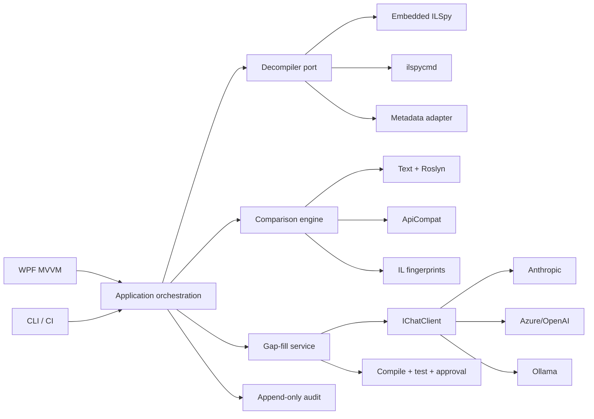

# DecompileForge

Production-oriented C# recovery workbench for comparing source repositories with deployed .NET releases, inspecting semantic/API/IL drift, and creating human-reviewed AI gap-fill proposals.

## Capabilities

- Pluggable decompiler architecture: embedded `ICSharpCode.Decompiler`, `ilspycmd`, and safe metadata fallback.
- Multi-layer comparison: file/text, Roslyn-normalized C#, ApiCompat contract checks, and method IL SHA-256 fingerprints.
- WPF MVVM workbench and automation-friendly CLI.
- Provider-neutral AI gateway through `Microsoft.Extensions.AI.IChatClient`: Anthropic, OpenAI, Azure OpenAI, and Ollama.
- Authorization gate, append-only JSONL audit, deterministic artifact hashing, and no automatic AI patch application.
- xUnit tests, GitHub Actions, CodeQL, vulnerability scanning, build/bootstrap scripts, ADR, threat model, and operations runbook.

## Architecture



## Quick start

```powershell
./scripts/bootstrap.ps1
./scripts/build.ps1
$env:ANTHROPIC_API_KEY = '<from-secret-store>'
dotnet run --project ./src/DecompileForge.Wpf
```

CLI:

```powershell
dotnet run --project ./src/DecompileForge.Cli -- decompile ./release/App.dll ./recovered --authority TICKET-123 --purpose "Disaster recovery"
dotnet run --project ./src/DecompileForge.Cli -- compare ./repo/Service.cs ./recovered/Service.cs
dotnet run --project ./src/DecompileForge.Cli -- compare ./baseline/App.dll ./production/App.dll
```

Exit code `2` means differences were found, making the compare command suitable for CI release gates.

## Important limits

Decompiler output is evidence, not original source. Comments, meaningful local names, source formatting, conditional-compilation intent, project metadata, and some optimized/obfuscated constructs cannot be recovered reliably. AI can propose plausible code but cannot prove original intent. Prefer PDB/Source Link, build artifacts, tests, logs, and other deterministic evidence first.

This repository is a production-ready foundation, not a claim that arbitrary third-party binaries can be safely or legally reconstructed. Use only on software you own or are explicitly authorized to inspect. Obtain jurisdiction-specific legal advice where needed.

## Documents

- `RESEARCH-REPORT.md` — deep research and engineering plan.
- `docs/adr/0001-architecture.md` — architecture decision.
- `docs/threat-model.md` — abuse and security controls.
- `docs/runbooks/operations.md` — setup, workflow, and incident runbook.
- `PACKAGE-MANIFEST.md` — package inventory.
